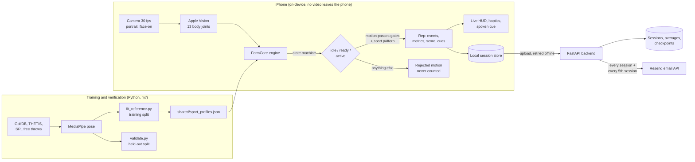

# FormCoach

An iPhone app that watches you practise **golf, tennis, pickleball or basketball** from a phone on
a tripod in front of you. It counts real swings and shots only, scores each one against
professional reference ranges, tells you what to fix, saves every session, and emails you
progress reports.

## Web demo

Try it in the browser, no install: **https://bryanzhao08.github.io/posture-correction/**. Pose
tracking runs on your device and sessions stay in that browser (no login or emails). Setup,
deploys and limits: [`docs/WEB_DEMO.md`](docs/WEB_DEMO.md).

## How it works



**Project workflow** (the order this was built in):

1. **Framework**: shared contracts (`docs/CONTRACTS.md`), the analysis engine as a Python
   reference (`ml/formcoach/`) with a line-for-line Swift port (`ios/FormCore/`), the sport
   profiles file that holds every threshold and pro range (`shared/sport_profiles.json`).
2. **Requirements** per sport (below).
3. **Backend**: login, session storage, averages, checkpoints, emails (`backend/`).
4. **Data**: public datasets, pose extraction, a training batch that fits the pro reference ranges,
   and a verification batch on held-out data (`ml/`).
5. **iOS app** on top of FormCore (`ios/FormCoach/`), deployed through Xcode
   (`docs/XCODE_DEPLOY.md`).

## Requirements

### All sports
- Phone on a tripod **in front of the player (face-on)**, portrait, full body in frame. The app
  checks framing (face and both feet visible, body 45 to 90% of the frame height) and that the
  phone is upright before it starts counting.
- **Count only real motions.** The engine tracks active vs passive state: a motion must be fast
  enough to trigger, then pass the sport's gates (duration, speed, size, start and end position)
  and the sport's movement-pattern check. Waggles, dribbles, walking, stretching, taking the
  racket back, lowering the arms after a shot and leaving the frame mid-motion are rejected, and
  the app shows how many motions were ignored and why.
- Every rep gets a 0-100 score per metric against a professional range, an overall rep score and
  up to two coaching cues. The session score is 85% average form + 15% consistency.
- Login (email and password, JWT), account deletion in the app, sessions saved on the phone first
  and uploaded with retries, per-session comparison against your own previous average, and a
  **checkpoint every 5 sessions** comparing that block with the previous one. Both are emailed
  through a separate email API (Resend) and can be switched off.

### Per sport (what a face-on camera can actually measure)

| Sport | Counted motion | Metrics |
|---|---|---|
| Golf | full swing (address, top, impact, finish detected) | tempo, lead arm at top, head sway, head height change, hip sway, shoulder turn, finish balance |
| Basketball | jump shot / free throw (dip, set point, release) | leg drive, elbow extension, elbow flare, release height, arm line, follow-through hold, sideways drift, dip-to-release rhythm |
| Tennis | forehand, backhand, serve (classified automatically) | stance height, arm extension at contact, contact height, swing-through, unit turn, head stability, swing tempo |
| Pickleball | forehand, backhand, overhead | staying low, paddle-up ready position, compact backswing, contact, follow-through, head stability |

Knee angle is deliberately not used: facing the camera, knees bend toward the lens and look
straight in 2D. Hip drop and stance height are used instead.

## Validation (verification batch, data the fit never saw)

Full report: [`ml/reports/validation.md`](ml/reports/validation.md).

| Sport | Data | Counting | Scoring |
|---|---|---|---|
| Golf | GolfDB, 64 held-out pro swings | **97%** of labelled swings counted; impact timed to 0 ms median, top of swing 33 ms | held-out pros median 97 |
| Golf | Penn Action, 81 face-on real-world swings (all levels) | **83%** counted (was 64% with pro-fitted thresholds) | |
| Basketball | SPL, 187 free throws by 2 held-out athletes | **98%** counted exactly once, 0 double counts, 569 non-shot motions ignored | held-out median 94 |
| Tennis | THETIS, 333 held-out clips (experts + beginners, 17 fps Kinect video) | 69-73% counted exactly once; stroke type 79-86% correct | experts out-score beginners, AUC 0.73 |
| Pickleball | Penn Action tennis forehands as a proxy (no pickleball data exists) | 85% of proxy strokes counted | coaching priors |

Motions that must not count ([Penn Action](http://dreamdragon.github.io/PennAction/), 1,257 clips
of squats, jumping jacks, push-ups, pull-ups, sit-ups, jump rope, bench press, guitar, barbell lifts):
golf 0%, tennis 1%, pickleball 1%, basketball 4% (almost all barbell jerks and pull-ups; squats
1 of 231, jumping jacks 0 of 112). Other sports' swings (baseball, bowling) do register in the
racket sports, since they are swinging motions; the user picks the sport, so this is acceptable.

Honest limits:
- **Tennis** is the weakest: THETIS is 17 fps shadow swinging, and slow beginner swings overlap
  with ordinary arm movement. Expect better on a 30 fps phone, but it needs real phone data.
- **Pickleball** has no public pose dataset. It uses the tennis analyser with prior ranges;
  `docs/DATA_COLLECTION.md` describes how to collect a validation set.
- A face-on camera cannot see how far the arm reaches *toward* it, so arm extension is only scored
  on serves and overheads, not groundstrokes or dinks.
- The basketball form score does not predict makes vs misses (AUC 0.41): it measures technique
  consistency with the reference shooters, not outcome.
- Golf tempo is only moderately reliable at 30 fps (the downswing is about 8 frames), so it is
  down-weighted.
- GolfDB is CC BY-NC 4.0 and Penn Action is for research use: fine for prototyping, but check
  licensing before a commercial launch.

## Repository layout

```
shared/sport_profiles.json   thresholds, gates and pro reference ranges (single source of truth)
ml/formcoach/                Python reference engine (engine, sports, scoring, synthetic data)
ml/datasets.py               GolfDB / THETIS / SPL loaders
ml/extract_pose.py           MediaPipe pose extraction from video
ml/fit_reference.py          training batch: fit pro ranges
ml/validate.py               verification batch: writes ml/reports/validation.md
ml/tools/render_pose.py      render skeleton + engine state over a video for debugging
ml/tests/                    engine tests on synthetic recordings + Swift/Python parity test
backend/                     FastAPI API, SQLite, JWT auth, Resend emails, tests
ios/FormCore/                Swift port of the engine (Swift package + formcore-check tool)
ios/FormCoach/               SwiftUI app (camera, Vision, sessions, history, settings)
web/                         browser demo (Vite + TypeScript engine port, MediaPipe pose)
docs/                        contracts, Xcode deployment guide, privacy draft, data collection
```

## Quick start

```bash
python3 -m venv .venv && .venv/bin/pip install -r backend/requirements.txt -r backend/requirements-dev.txt numpy
.venv/bin/python -m pytest backend/tests ml/tests -q          # backend + engine tests
cd backend && ../.venv/bin/uvicorn app.main:app --host 0.0.0.0 --port 8000
```

iOS: see [`docs/XCODE_DEPLOY.md`](docs/XCODE_DEPLOY.md) (`brew install xcodegen`, `cd ios && xcodegen generate`).

End-to-end test in the Simulator (with the backend running on port 8000). The Simulator has no
camera, so DEBUG builds replay a recorded session through the same pipeline:

```bash
cd ios && xcodebuild test -project FormCoach.xcodeproj -scheme FormCoach \
  -destination 'platform=iOS Simulator,name=iPhone 16 Pro'
```

Swift engine parity with the Python reference: `python -m pytest ml/tests/test_parity.py`
(builds `ios/FormCore` and compares every rep, metric and score).

Reproduce the training and verification batches (downloads about 2 GB of datasets; see
`ml/datasets.py` for sources): download into `ml/data/`, run `extract_pose.py` with the CPU pose
environment (`mediapipe==0.10.14`), then `python ml/fit_reference.py && python ml/validate.py`.
